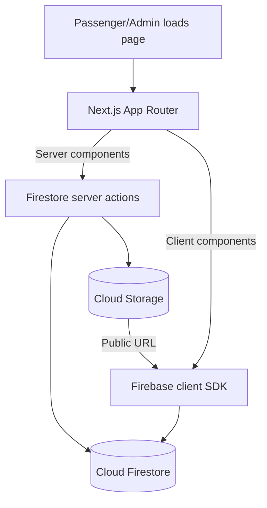

# Development Notes

This document captures the architectural decisions and operational shortcuts I took while assembling the ASG Transport Hub. Having everything written down here makes it easier for me (or the next person) to extend the project without reverse engineering the workflow from scratch.

## Request Lifecycle Overview

1. Server components (or server actions) fetch initial data using the Firebase Admin SDK so that the rendered HTML already contains the latest snapshot.
2. Client components subscribe to the same collections via the Firebase client SDK, which gives me realtime updates once the page hydrates.
3. Mutations (add/update/delete) are implemented as [Next.js Server Actions](https://nextjs.org/docs/app/building-your-application/data-fetching/server-actions). They run on the server, talk to Firestore/Storage using the Admin SDK, and finally call `revalidatePath` to invalidate any cached routes that depend on the data.

## Authentication Flow

- `src/lib/firebase/provider.tsx` wraps the entire client tree. It listens to `onAuthStateChanged` and exposes `{ user, loading, firestore }` via context.
- `src/hooks/use-auth.ts` is a thin helper that pulls the auth state from the provider. I keep it isolated so dashboard components have a clean interface.
- `src/components/shared/AuthGuard.tsx` protects admin routes. If `user` is missing once loading completes, it redirects to `/admin`.

### Admin dashboard component map

| Component | Responsibility | Notes |
|-----------|----------------|-------|
| `src/app/admin/page.tsx` | Handles the login form and redirects authenticated users to the dashboard. | I rely on client-side routing so the transition feels instant once the auth listener fires. |
| `src/app/admin/dashboard/page.tsx` | Fetches realtime Firestore snapshots and passes them to the client shell. | Queries are memoized to avoid spinning up duplicate listeners. |
| `src/components/admin/DashboardClient.tsx` | Layout shell with tabs, logout button, and header branding. | Lives on the client so I can tap into Firebase Auth directly. |
| `src/components/admin/*Manager.tsx` | CRUD UI for each collection. | Each manager owns its own modal/dialog state to stay self-contained. |

## Data Model Cheatsheet

| Collection | Notes |
|------------|-------|
| `routes`   | The `id` doubles as the document path. I slugify the route name and spec to keep URLs predictable. `lastUpdated` is stored as an ISO string so both client and server code can render it without Firestore-specific conversions. |
| `drivers`  | Drivers are a simple lookup table. `routeId` stores the related route document ID so I can render cross references in the UI. |
| `alerts`   | Alerts are intentionally minimal. The dashboard only cares about `titulo` and `lastUpdated`. |

## Image Upload Strategy

- Uploads happen from the client via a `<form>` that posts to the `uploadFile` server action.
- The server action streams the file into Cloud Storage using the Admin SDK and marks the object `public`. That gives me a CDN-backed URL I can embed directly into the Firestore document.
- I prefix filenames with `uuidv4()` to avoid collisions and keep the folder tidy (`route-images/`).

## Local Development Tips

- If I need mock data quickly, I use the Firebase Emulator Suite. Point the Admin SDK to the emulator with `FIREBASE_EMULATOR_HOST` in `.env.local`.
- The UI uses Tailwind via CSS variables, so hot reloading works well. Running `npm run lint` before committing catches most typos in server actions.
- When editing form schemas, remember to update both the Zod schema and the Firestore type definitions in `src/lib/definitions.ts`.
- I keep the `AdminScript/` folder around for ad-hoc tasks (granting claims, auditing users). They run separately from Next.js, so I load environment variables manually when I need them.

## Deployment Checklist

1. Move the Firebase client config into environment variables and load them in `src/lib/firebase/config.ts`.
2. Set up a dedicated service account for Next.js with Firestore/Storage access, then configure the secrets in your hosting provider (Vercel, Cloud Run, etc.).
3. Enable the Next.js [Image Optimization remote patterns](https://nextjs.org/docs/app/api-reference/components/image#remote-patterns) for your Storage bucket domain if you deploy behind Vercel.
4. Review Firestore and Storage security rules so only authenticated admins can mutate content.
5. Trigger a production build with `npm run build` and check the Firebase logs for any Admin SDK permission issues.

Keeping this list close by saves me a ton of time whenever I revisit the project after a break.

## Server action cheat sheet

- `addRoute`, `updateRoute`, `deleteRoute` in `src/lib/actions.ts` mutate the `routes` collection and invalidate both `/admin/dashboard` and `/` so the public site stays fresh.
- `addDriver`, `updateDriver`, `deleteDriver` follow the same pattern but only revalidate the dashboard. Drivers are admin-only today.
- `addAlert` and `deleteAlert` both refresh the dashboard and the landing page hero.
- `uploadFile` streams uploads through the Admin SDK so the Storage bucket never has to trust unauthenticated clients.

Whenever I add a new mutation I duplicate the pattern above: wrap the work in a helper, revalidate the consuming routes, and log detailed errors so I can debug Cloud Logging traces later.
